| Topic | Session |
|----|----|
| Graph fundamentals (degree, paths, adjacency matrix, complete graph) | 1 |
| Clustering coefficient, diameter, power law, preferential attachment, homophily | 2 |
| Social APIs: request/response, authentication, endpoints, node/edge/text data | 3 |
| Text analytics: tf-idf, cosine similarity, topic model | 4 |
| **Centrality / influence: degree, closeness, betweenness, eigenvector, PageRank** | **5** |
| Community detection: modularity Q, edge betweenness (Girvan–Newman) | 6 |
| Node similarity: Jaccard, Adamic–Adar, SimRank, graph edit distance | 7 |
| Embeddings: SkipGram pair count, cosine similarity, DeepWalk | 8 |

------------------------------------------------------------------------

# SESSION 1 — Introduction & Graph Fundamentals

## Key definitions

- **Graph** $G = (V,E)$: vertex set $V$ + edge set $E$. If $(u,v) \in E$, u and v are **adjacent** (neighbors).
- **Undirected** edge $(a,b)$ (Facebook) vs **directed** edge $a \rightarrow b$ (Twitter follow). **Weighted** edge adds a strength value.
- **Complete graph**: every pair of vertices is adjacent. **Clique**: a subset of vertices that are pairwise adjacent.
- **Connected graph**: every pair of vertices is reachable → one connected component; otherwise two or more components.

### Walk, path and cycle (slide definitions)

- A **walk** is a sequence of vertices where each pair of consecutive vertices are adjacent.
- A **path** is a walk with all vertices distinct except the start and end.
- A **cycle** is a path with the same start and end.

<figure>
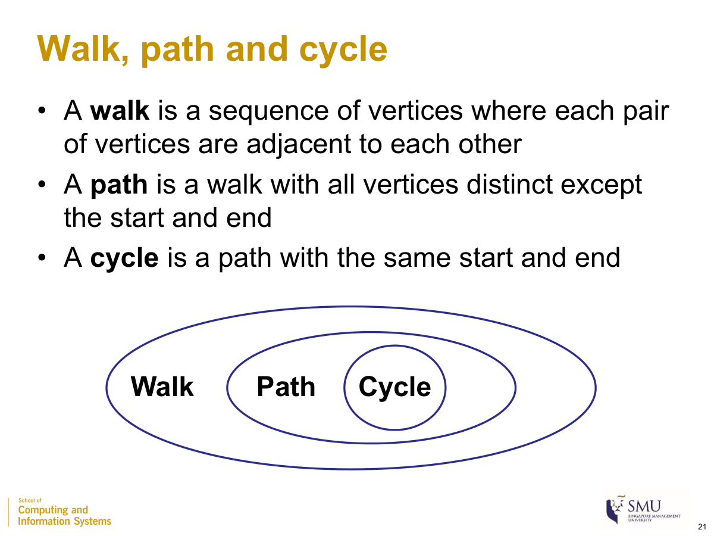
<figcaption aria-hidden="true">
Walk ⊃ path ⊃ cycle (Session 1, slide 21)
</figcaption>
</figure>

## Edges in a complete graph

$$
|E| = \frac{n(n - 1)}{2}
$$

where

- $|E|$: number of edges
- $n$: number of nodes (vertices)

*Example:* $n = 10 \Rightarrow \frac{10 \cdot 9}{2} = \mathbf{45}$ edges.

## Degree

$$
deg(v) = \text{number of edges with }v\text{ as an endpoint}
$$

where (directed graph)

- $\text{indeg}(v)$: number of edges pointing **into** v
- $\text{outdeg}(v)$: number of edges pointing **out of** v

*Example:* edges {(a,b),(a,c),(a,d),(b,c)} → deg(a)=3, deg(b)=2, deg(c)=2, deg(d)=1.

## Degree and edges

$$
\sum_{v \in V}^{}\deg(v) = 2\,|E|\quad\quad\text{(directed: }\sum\text{indeg}(v) = \sum\text{outdeg}(v) = |E|\text{)}
$$

where

- $\sum_{v \in V}^{}\deg(v)$: total degrees, summed over all nodes
- $|E|$: number of edges (each edge is counted at both endpoints, hence $2|E|$)

*Example:* degrees 3+2+2+1 = 8 = 2 × 4 (Number of edges = 4). ✓

## Weight and cost for a shortest path

For an unweighted graph the **costs on all edges are treated as one**; for a weighted graph the weight may be **interpreted as a cost**. **(FAQ)** when a higher weight means a stronger/closer tie, convert it:

$$
\text{cost} = \frac{1}{\text{weight}}
$$

where

- $\text{weight}$: edge weight (higher = stronger/closer tie)
- $\text{cost}$: traversal cost used by shortest-path algorithms (stronger tie ⇒ cheaper)

*Example:* weight 4 → cost 0.25; weight 1 → cost 1.0.

## Distance of a path

$$
\text{distance(path)} = \sum_{e\, \in \,\text{path}}^{}\text{cost}(e)
$$

where

- $\text{cost}(e)$: cost of edge $e$ (= 1 for every edge in an unweighted graph)
- the **shortest path** between two nodes is the path with the **minimum** total distance

*Example (weighted):* a path with edge costs 1+3+1 = 5; an alternative costing 1+1+1 = 3 is shorter.

## Storing a graph

- **Adjacency matrix**: $n \times n$; entry $(i,j) = 1$ if there is an edge from i to j (or stores the weight). Symmetric for undirected graphs; size $n^{2}$, so the slides call it **adjacency matrix (sparse)**. A 1 on the diagonal = an edge from a node to itself **(FAQ — self-loop)**.
- **Adjacency lists**: store, per node, only its neighbors — compact for the sparse graphs typical of social networks.

------------------------------------------------------------------------

# SESSION 2 — Social Networks as Graphs

> Centrality measures are **not** in this session — see Session 5.

## Graph types

- **Bipartite graph** $G = (U,V,E)$: two disjoint node sets; every edge crosses between them; none within a set.
- **Ego-network**: a focal node (the **ego**) with its neighbors and the edges among them.
- **Heterogeneous information network (HIN)**: multiple node and edge types, with attributes.
- **Co-occurrence graph**: nodes linked when they appear together.

## Ego-network size

$$
\text{nodes} = d + 1,\quad\quad\text{min edges} = d,\quad\quad\text{max edges} = \frac{d(d + 1)}{2}
$$

where

- $d$: degree of the ego (its number of neighbors)
- min edges = the star (ego to each neighbor); max edges = a complete graph on $d + 1$ nodes

*Example:* $d = 4$ → 5 nodes, from 4 edges (star) to 10 edges (complete).

## Network diameter (small-world)

The diameter summarizes the **shortest distances** between all node pairs (taken as the average, the maximum, or a percentile). Social networks are **small-world** with a **small diameter**:

$$
L\mspace{6mu} \propto \mspace{6mu}\log N
$$

where

- $L$: average shortest distance between node pairs
- $N$: number of nodes

**Common definitions of network diameter**

– **Average** shortest distance among all pairs

– Maximum / 90th percentile shortest distance, etc.

**Social networks tend to have a small diameter**

A few **celebrity (high-degree) nodes** create shortcuts that keep $L$ small. *Example (5-node graph, 10 pairs, distances 1,3,1,2,3,1,2,2,1,1, sum = 17):* maximum diameter = **3**; average = 17/10 = **1.7**.

## Power-law degree distribution

$$
y\mspace{6mu} \approx \mspace{6mu} a\, x^{- k}
$$

where

- $x$: node rank by degree; $y$: the node’s degree
- $a$: scaling constant; $k > 0$: the power-law exponent

A few celebrity nodes have very high degree, most other nodes have low degree — the **80-20 rule** (~20% of nodes hold ~80% of connections).

## Clustering coefficient ⭐

A **global** measure of how strongly connected triplets close into triangles. A **connected triplet** = three nodes with at least two edges (**closed** if it forms a triangle, **open** otherwise).

$$
C = \frac{\text{number of closed triplets}}{\text{number of all triplets}} = \frac{3 \times \text{number of triangles}}{\text{number of all triplets}}
$$

where

- closed triplet: a triplet whose three nodes are all connected (a triangle)
- all triplets: open + closed triplets
- the factor **3**: each triangle contains 3 closed triplets (one centered on each node); range of $C$ is 0–1

<figure>
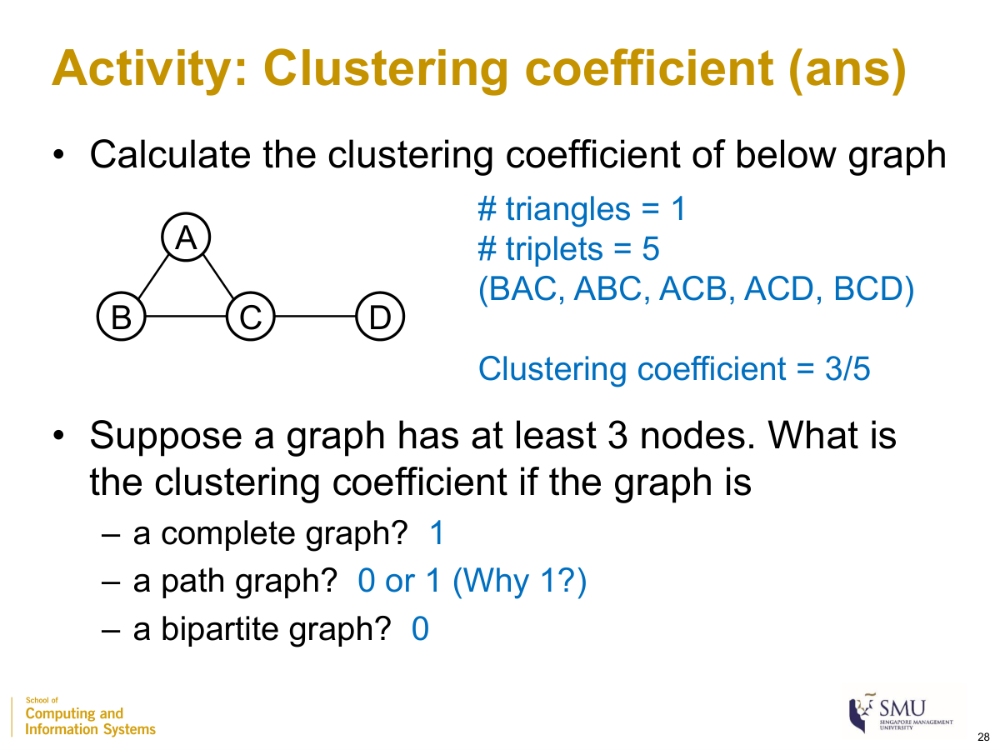
<figcaption aria-hidden="true">
Clustering coefficient worked example (Session 2, slide 28)
</figcaption>
</figure>

*Example (triangle A–B–C plus edge C–D):* \# triangles = 1; \# triplets = 5 (BAC, ABC, ACB closed; ACD, BCD open) → $C = 3/5 = \mathbf{0.6}$. *Special cases (≥3 nodes):* complete graph → **1**; path graph → **0 or 1**; bipartite graph → **0**.

## Preferential attachment (Barabási–Albert)

$$
p_{u} = \frac{d_{u}}{\sum_{v}^{}d_{v}}
$$

where

- $p_{u}$: probability a new node links to existing node u
- $d_{u}$: current degree of u
- $\sum_{v}^{}d_{v}$: total degrees of all nodes ($= 2|E|$)

*Example:* $d_{u} = 5$, total degrees = 14 → $p_{u} = 5/14 \approx 0.357$; a degree-1 node → $1/14 \approx 0.071$.

## Homophily ratio

$$
h = \frac{\text{number of edges between same-class nodes}}{\text{total number of edges}}
$$

where

- $h$: global homophily ratio, range 0–1
- “class”: a node attribute defined by the analyst (university, interest, …)

*Example:* 8 of 9 edges join same-university students → $h = 8/9 \approx \mathbf{0.889}$.

------------------------------------------------------------------------

# SESSION 3 — Social APIs

> Conceptual session (no formulas). Demonstrated with the **Reddit API**: how a program requests data from a social-media service and how that data maps to **node, edge and text** data.

## What is an API

**API = Application Programming Interface** — a collection of functions for building applications. A local **client** (your laptop) sends a parameterized **request** to an **API provider**, which returns a **response** containing data.

- **Provider can be local or remote.** Local example: `len('hello world')` is an API request to Python; the response is the integer `11`. Remote example: a request to Reddit for a user’s profile, the posts/comments on a topic, etc.
- **Endpoint** = a unique location identifier used to communicate with the API. For remote services, endpoints are **URL addresses** (e.g. `https://oauth.reddit.com/api/v1/me`).
- **APIs change frequently** — names, parameters and responses can change at any time, so you must learn to read the API **documentation**.

## API etiquette (rules)

- **Don’t be abusive:** strictly follow the provider’s use cases, policies, terms and conditions.
- **Don’t be aggressive:** respect **rate limits** (at most X calls in any Y-minute window). For Reddit the limit is **60 calls per minute**.
- Abusive/aggressive behavior can get your **account or IP banned**.

## Authentication vs authorization

- **Authentication** confirms a user’s **identity** (who you are).
- **Authorization** determines a user’s **access rights** to resources (what you may access).
- For a Reddit “**script**” app you register at *preferences → apps*, you receive an **ID** and a **secret token** (treat like passwords). Credentials are stored in `mysecrets.py`; the `requests` package sends the HTTP request.

## Response: status code + JSON

The response carries a **status code** telling whether the request succeeded:

| Code    | Meaning                                          |
|---------|--------------------------------------------------|
| **200** | success                                          |
| **401** | unauthorized (no/incorrect credentials)          |
| **403** | forbidden (correct credentials but no privilege) |
| **404** | not found (incorrect endpoint)                   |
| **500** | internal server error (temporary server issue)   |

The response **content is in JSON** format, accessed with `response.json()` and stored in Python containers (dictionaries, lists). Keys are mostly self-explanatory but usually undocumented — you map them to attributes manually.

## Simple wrapper (`reddit_wrapper.py`)

Standard API steps (authenticate → authorize → check status → parse JSON) are bundled into two functions:

- `reddit_api_init()` — authenticates and obtains authorization; stores the token in a global `headers` used by later calls.
- `reddit_api_call(endpoint, params)` — sends the request, receives the response, and **sleeps 1 second** before returning (to stay under 60 calls/min). The prefix `https://oauth.reddit.com/` is hard-coded, so only the rest of the `endpoint` is passed. Returns the status code if unsuccessful, or the JSON content if successful.

## Use cases — node, edge and text data

**Node data** (an entity = a node, e.g. a user or a subreddit):

| Target           | Endpoint                                         |
|------------------|--------------------------------------------------|
| A user’s profile | `user/[USERNAME]/about` (your own = `api/v1/me`) |
| A subreddit      | `r/[SUBREDDIT]/about`                            |

**Edge data** (a relationship = an edge):

- **user–subreddit edge** (a user posts in a subreddit) → crawl posts with `r/[SUBREDDIT]/new` (newest) or `r/[SUBREDDIT]/hot` (trending). Store records in a `pandas` dataframe.
- **user–user edge** (a user comments on another’s post) → get a post’s comments with `comments/[POST_ID]`.
- **Friends/followers are NOT public** — they cannot be obtained without that user’s authorization.

*Pagination for list responses:* - `limit` — how many items to retrieve (**default 25, maximum 100**). - `after` — a **bookmark**: return items *after* a given reference, so you can fetch the next page beyond 100. Get the `after` reference from the current response and pass it to the next request.

**Text data** (posts and comments are obtained as a by-product of edge data; plus **search**):

- `search` endpoint with a `q` parameter (query keywords, a string **≤ 512 characters**). Optional `sort` (ordering) and `t` (time window) parameters.
- Restrict to one subreddit with `r/[SUBREDDIT]/search` **and** `restrict_sr=on`.

# SESSION 4 — Social Text Analytics

## Vector space model (bag of words)

Each document is a vector over the **vocabulary**; **each word = one dimension**, value = its count. A set of documents is a **corpus**. Word order is ignored; vectors are high-dimensional and mostly zero.

## Dot product

$$
d_{1} \cdot d_{2} = \sum_{i}^{}d_{1i}\, d_{2i}
$$

where

- $d_{1i},d_{2i}$: the i-th component (word count) of document vectors $d_{1}$ and $d_{2}$
- a first cut at overlap, but **biased toward longer documents**

*Example:* $d_{1} = (1,1,1,1,1)$, $d_{2} = (1,1,1,2,1)$ → 1+1+1+2+1 = 6.

## Length of a document vector

$$
\left\| v \right\| = \sqrt{\sum_{i}^{}v_{i}^{\, 2}}
$$

where

- $v_{i}$: the i-th component of vector $v$
- $\left\| v \right\|$: length of the document vector (Euclidean norm), used for **document-length penalization**

*Example:* $v = (4,3)$ → $\sqrt{4^{2} + 3^{2}} = \sqrt{25} = 5$.

## Cosine similarity ⭐

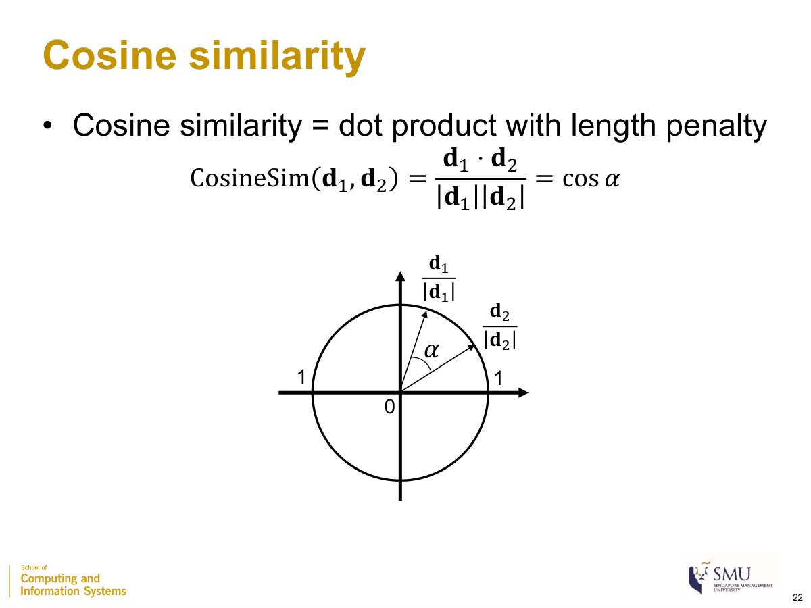

Cosine similarity = the dot product with a length penalty:

$$
\text{CosineSim}(d_{1},d_{2}) = \frac{d_{1} \cdot d_{2}}{\left\| d_{1} \right\|\,\left\| d_{2} \right\|} = cos\alpha
$$

where

- $d_{1} \cdot d_{2}$: dot product of the two document vectors
- $\left\| d_{1} \right\|,\left\| d_{2} \right\|$: their lengths
- $\alpha$: the angle between the vectors; $\cos 0{^\circ} = 1$ (maximum similarity), $\cos 90{^\circ} = 0$ (minimum)

Cosine similarity = dot product with length penalty (Session 4, slide 22)

*Example:* $d_{1} = (1,1,1,1,1,0,0,0,0)$, $d_{2} = (1,1,1,0,1,0,0,0,0)$, $d_{3} = (1,1,1,1,1,1,1,1,1)$.

‖d1‖=√5≈2.24, ‖d2‖=2, ‖d3‖=3; d1·d2=4, d1·d3=5.

CosineSim(d1,d2) = 4/(2.24·2) = **0.89**;

CosineSim(d1,d3) = 5/(2.24·3) = **0.74** (cosine fixes the dot-product’s length bias).

## Term frequency, inverse document frequency, tf-idf

$$
\text{tf-idf}(w,d) = \text{tf}(w,d) \times \text{idf}(w)
$$

where

- $\text{tf}(w,d)$: term frequency = number of times word w appears in document d (importance within d)
- $\text{idf}(w)$: inverse document frequency — **smaller for words appearing in more documents** (importance across the corpus). *The slides give no idf equation*; the cited Wikipedia form is $\text{idf}(w) = log\frac{N}{df(w)}$ with $N$ = number of documents, $df(w)$ = number containing w.

*Example:* corpus of $N = 4$. “analytics” in all 4 docs → idf $= log(4/4) = 0$ ⇒ tf-idf = 0 regardless of count. “exciting” in 1 doc → idf $= log4 \approx 0.602$; tf = 1 ⇒ tf-idf ≈ 0.602.

## Preprocessing

- **Stop words**: very frequent, low-meaning words — usually removed; list is subjective (motivates idf).
- **Stemming** (fixed rules, fast, less accurate) vs **lemmatization** (dictionary + part of speech, accurate, costlier).
- **Tokenization** = splitting into words. **n-grams** = treating n consecutive words as a unit **(FAQ)**.

## Sentiment analysis

Types: **polarity** (pos/neg), **subjectivity vs objectivity**, **aspect-based opinion mining**. Approaches: **lexicon-based** vs **machine-learning-based** (preprocess → feature engineering with tf/idf → train with labels → predict).

## Topic modeling

**Each topic = a multinomial distribution over words; each document = a multinomial distribution over topics.** Probability of an observed set of words from a topic:

$$
P = \left( \prod_{i}^{}p_{i} \right) \times k!
$$

where

- $p_{i}$: probability of the i-th observed word under the topic
- $k$: number of word slots; $k!$ accounts for all orderings

*Example:* topic Party = {Sushi 0.3, Beer 0.7}, document {Sushi 1, Beer 1}: $P = 0.3 \times 0.7 \times 2! = \mathbf{0.42}$; under topic Food {Sushi 0.3, Beer 0.1}: $0.3 \times 0.1 \times 2! = 0.06$ → document is “Party”. Learned by **LDA** and **BERTopic**.

# SESSION 5 — Social Influence (Centrality)

> **Simple centrality measures** (degree, closeness, betweenness) treat all nodes equally; **recursive centrality measures** (eigenvector, PageRank) weight a node by the importance of its neighbors.

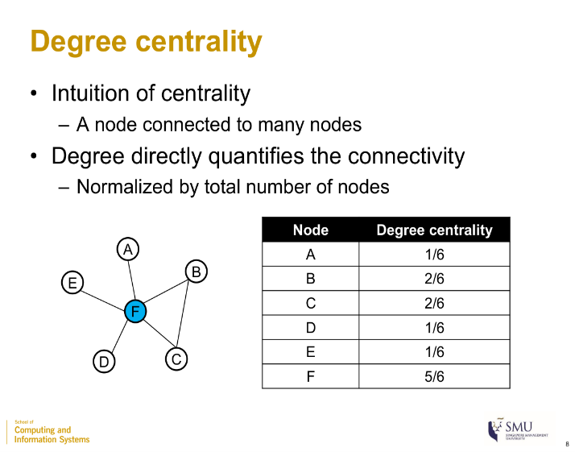

## Degree centrality

$$
C_{\deg}(u) = \frac{deg(u)}{|V|}
$$

where

- $deg(u)$: number of edges incident to u
- $|V|$: total number of nodes (the slides normalize by the total number of nodes)

Degree centrality on a star graph (Session 5, slide 8)

*Example (star, hub F):* F = 5/6; each leaf = 1/6. (In the activity below, B = 3/6, F = 3/6. Use the denominator the figure shows; some textbooks use $|V| - 1$.) Directed graphs use in-degree or out-degree. **Use when:** a fast result / nodes that directly reach many others.

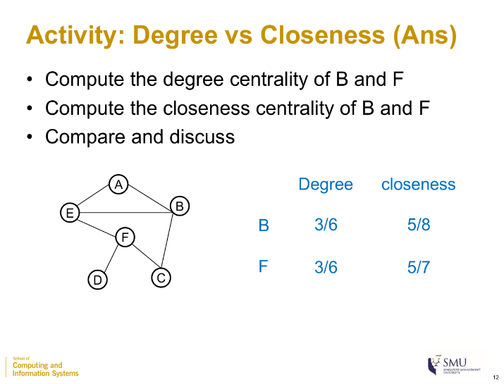

## Closeness centrality

$$
C_{close}(u) = \frac{|V| - 1}{\sum_{v \in V}^{}d(u,v)}
$$

where

- $|V| - 1$: number of other nodes
- $d(u,v)$: shortest-path distance between u and v
- the denominator $\sum_{v}^{}d(u,v)$: total shortest distance from u to all others (so $C_{close}$ is the reciprocal of the **average** shortest distance)

*Example:* node B = 5/8; node F = 5/7. B and F have equal degree (3/6) but F is closer on average. **Use when:** finding who can influence a large proportion of the network most quickly.

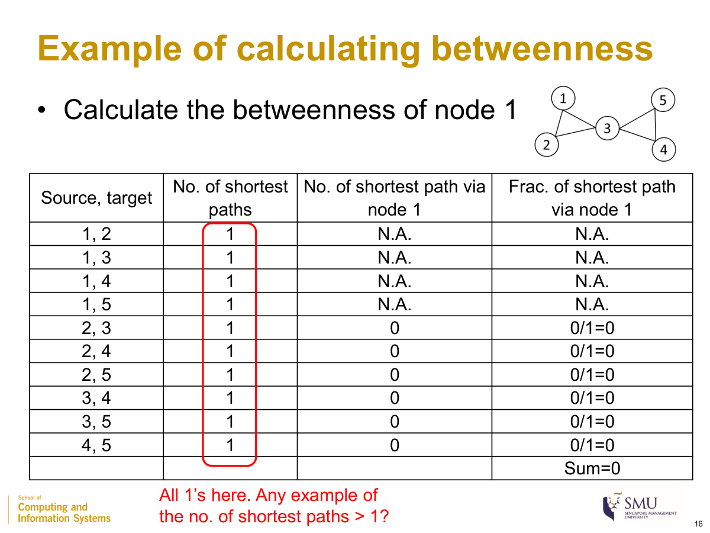

## Betweenness centrality

$$
\text{betweenness}(u) = \sum_{s \neq u \neq t \in V}^{}\frac{\sigma_{st}(u)}{\sigma_{st}}
$$

where

- $\sigma_{st}$: number of shortest paths from s to t
- $\sigma_{st}(u)$: number of those shortest paths that pass through u
- the sum runs over all pairs $s,t$ with $s \neq u \neq t$ (pairs involving u are excluded → “N.A.”)

Betweenness calculation example (Session 5, slide 16)

*Example (two triangles {1,2,3} and {3,4,5} joined at node 3):* every pair has a single shortest path ($\sigma_{st} = 1$). For **node 1** none of the other pairs’ paths pass through it → **betweenness(1) = 0**. For **node 3** the four pairs {1,2}×{4,5} all pass through it → **betweenness(3) = 4**. **Note:** if there is one shortest path the fraction is 0 or 1; if several, use the fraction. A high value can mean a genuine bridge **or** a node on the **periphery** of two groups. **Use when:** finding who controls the flow of information between groups.

## Eigenvector centrality (recursive)

$$
x_{u}\mspace{6mu} \propto \mspace{6mu}\sum_{v \in IN(u)}^{}x_{v}\quad\quad \Rightarrow \quad\quad A^{\top}x = \lambda x
$$

where

- $x_{u}$: centrality score of u (it is high if pointed to by high-scoring nodes)
- $IN(u)$: set of in-neighbors of u (nodes with a link to u)
- $A^{\top}$: transpose of the adjacency matrix; $\lambda$: an eigenvalue ($x$ is an eigenvector of $A^{\top}$)

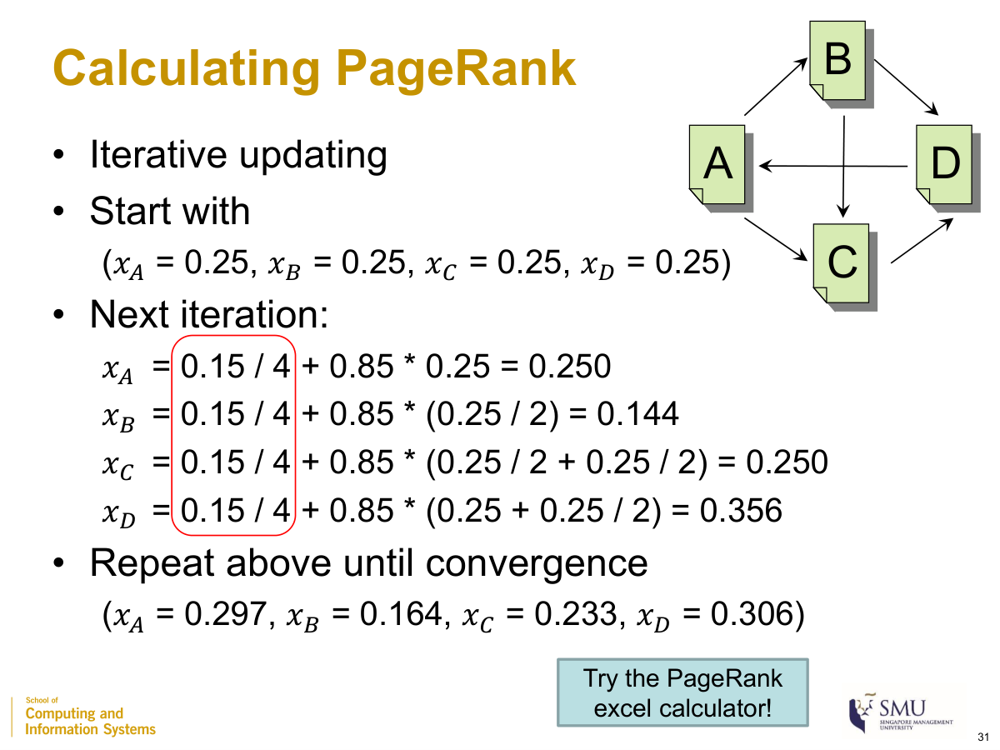

## PageRank ⭐ (a variant of eigenvector centrality)

$$
x_{u} = \frac{1 - \alpha}{|V|} + \alpha\sum_{v \in IN(u)}^{}\frac{x_{v}}{\text{outdeg}(v)}
$$

where

- $x_{u}$: PageRank score of u
- $\alpha$: damping factor, $\alpha = 0.85$
- $|V|$: total number of nodes; $\frac{1 - \alpha}{|V|}$ is the **teleportation probability** spread over all nodes
- $IN(u)$: in-neighbors of u; $\text{outdeg}(v)$: number of out-links of v (each node splits its score equally among its out-links)
- a page with no out-link distributes its score to all nodes

Calculating PageRank — one iteration (Session 5, slide 31)

*Example (edges A→B, A→C, B→C, B→D, C→D, D→A; out-degrees A=2, B=2, C=1, D=1;* $\frac{1 - \alpha}{|V|} = \frac{0.15}{4} = 0.0375$*; start all 0.25):* $x_{A} = 0.0375 + 0.85(0.25) = \mathbf{0.250}$; $x_{B} = 0.0375 + 0.85(0.25/2) = \mathbf{0.144}$; $x_{C} = 0.0375 + 0.85(0.25/2 + 0.25/2) = \mathbf{0.250}$; $x_{D} = 0.0375 + 0.85(0.25 + 0.25/2) = \mathbf{0.356}$. Iterate to convergence → A=0.297, B=0.164, C=0.233, D=0.306 (independent of the start).

### Which centrality to use

| Goal | Use |
|----|----|
| Influence a large proportion of the network most quickly | Closeness |
| Fast result / direct reach to many | Degree |
| Control the flow of information between groups | Betweenness |
| Importance derived from important neighbors | Eigenvector / PageRank |

------------------------------------------------------------------------

# SESSION 6 — Social Communities

A **community** is **more densely connected internally than with the rest of the network**. Detection = clustering vertices. Families: **agglomerative** (bottom-up, **merge**) and **divisive** (top-down, **split**). Two design questions: *how to merge/split* and *when to stop*.

## Expected edges (for modularity)

$$
E_{ij} = \frac{k_{i}\, k_{j}}{2m}
$$

where

- $E_{ij}$: expected number of edges between i and j if the m edges are rewired randomly while **keeping the same node degrees**
- $k_{i},k_{j}$: degrees of nodes i and j
- $m$: number of edges in the network; $2m = \sum_{i}^{}k_{i}$

## Modularity matrix

$$
B_{ij} = A_{ij} - \frac{k_{i}\, k_{j}}{2m}
$$

where

- $A_{ij}$: observed adjacency entry (1 if an edge between i and j, else 0)
- $\frac{k_{i}k_{j}}{2m}$: expected edges $E_{ij}$

## Modularity Q ⭐

$$
Q = \frac{1}{2m}\sum_{i,j}^{}\left( A_{ij} - \frac{k_{i}\, k_{j}}{2m} \right)\delta(s_{i},s_{j})
$$

where

- $A_{ij}$: observed edge; $\frac{k_{i}k_{j}}{2m}$: expected edge
- $k_{i},k_{j}$: node degrees; $m$: number of edges
- $\delta(s_{i},s_{j})$: 1 if i and j are in the **same community**, else 0
- $s_{i}$: community assignment of node i; range of $Q$ is −1 to 1 ($Q > 0$ ⇒ within-community edges exceed random)

**Shortcut:** $Q = \frac{1}{2m}\sum B_{ij}$ over pairs in the **same community** only. $Q$ depends on the community assignment; all nodes in one community ⇒ $Q = 0$.

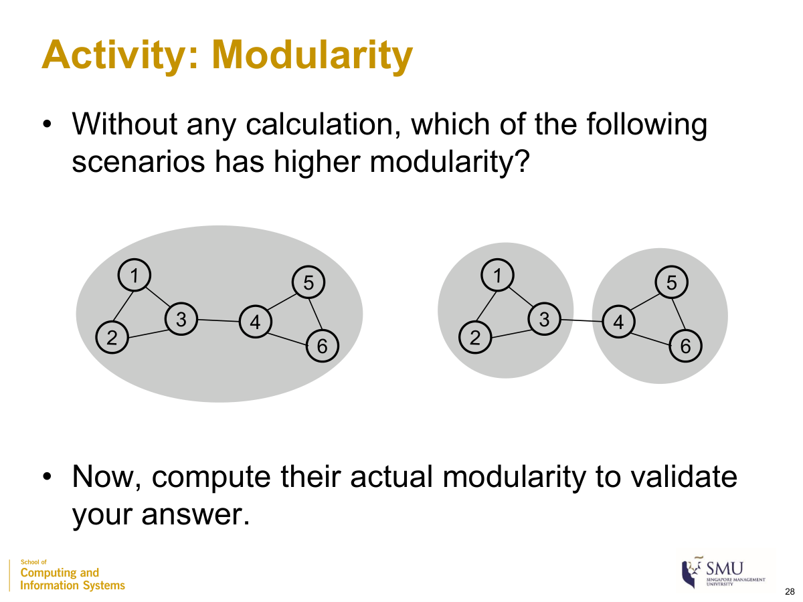

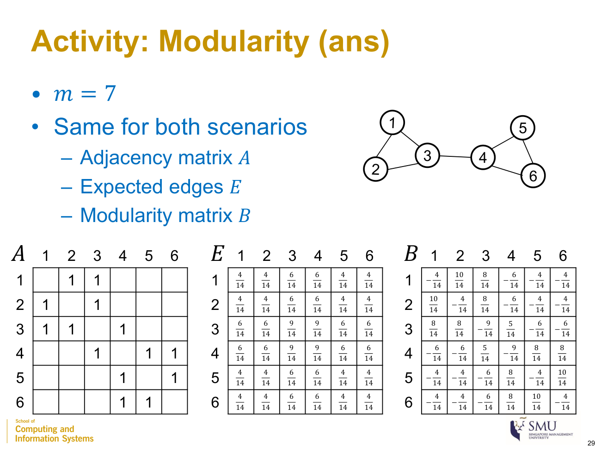

Graph: 6 nodes — two triangles {1,2,3} and {4,5,6} joined by the bridge edge (3,4). $m = 7$ so $2m = 14$; degrees $k = (2,2,3,3,2,2)$. The matrices **A, E, B are the same for both scenarios** — only the community assignment $\delta$ differs.

**Step 1 — Adjacency matrix A** $A_{ij} = 1$ if there is an edge between i and j, else 0.

**Step 2 — Expected edges E** $E_{ij} = \frac{k_{i}k_{j}}{2m}$. With $2m = 14$, the numerators $k_{i}k_{j}$ are (each entry ÷ 14):

**Step 3 — Modularity matrix B = A – E** subtract element-wise, $B_{ij} = A_{ij} - \frac{k_{i}k_{j}}{14}$ (each entry ÷ 14):

(e.g. $B_{12} = 1 - \frac{2 \cdot 2}{14} = \frac{10}{14}$; $B_{14} = 0 - \frac{2 \cdot 3}{14} = - \frac{6}{14}$.) A useful check: **every row of B sums to 0.**

**Step 4 — Apply δ and sum** (slide 30): $Q = \frac{1}{2m}\sum_{i,j}^{}B_{ij}\,\delta(s_{i},s_{j})$. The **δ matrix is a mask** that keeps only the B entries whose two nodes are in the **same** community (δ=1) and zeros out the rest (δ=0). So the only thing that changes between scenarios is *which entries of B you add up.*

<figure>
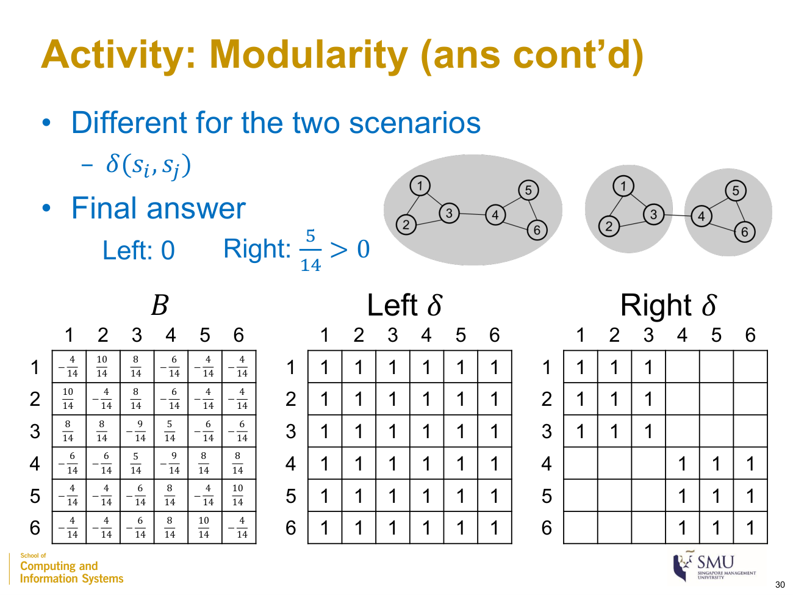
<figcaption aria-hidden="true">
δ mask for each scenario, with the final answers (Session 6, slide 30)
</figcaption>
</figure>

- **Left scenario — one community** (δ = all 1s): keep **every** B entry. Because each row of B sums to 0, the grand total is 0 → $\sum B_{ij}\delta = 0$ → $Q_{\text{Left}} = \frac{1}{14} \cdot 0 = \mathbf{0}$.
- **Right scenario — two communities {1,2,3} \| {4,5,6}** (δ = block-diagonal): keep only the two 3×3 blocks of B. Summing those numerators:
  - block {1,2,3}: $( - 4 + 10 + 8) + (10 - 4 + 8) + (8 + 8 - 9) = 14 + 14 + 7 = 35$
  - block {4,5,6}: $( - 9 + 8 + 8) + (8 - 4 + 10) + (8 + 10 - 4) = 7 + 14 + 14 = 35$
  - **total = 35 + 35 = 70** → $\sum B_{ij}\delta = \frac{70}{14} = 5$ → $Q_{\text{Right}} = \frac{1}{2m} \cdot 5 = \frac{1}{14} \cdot 5 = \frac{\mathbf{5}}{\mathbf{14}}\mathbf{\approx 0.357}$.

Since $Q_{\text{Right}} = 5/14 > Q_{\text{Left}} = 0$, the split into two triangles is the better community structure.

## Edge betweenness — Girvan–Newman (divisive)

$$
\text{betweenness}(e) = \sum_{s \neq t}^{}\frac{\sigma_{st}(e)}{\sigma_{st}}
$$

where

- $\sigma_{st}$: number of shortest paths from s to t
- $\sigma_{st}(e)$: number of those shortest paths that pass through **edge** e
- **bridge edges** between communities carry the most shortest paths → highest betweenness

*Example (same 6-node graph):* bridge edge (3,4) lies on all 9 shortest paths between the two triangles → **betweenness = 9**; an internal edge (1,2) → **betweenness = 1**. The algorithm removes the highest-betweenness edge first. **Agglomerative (modularity-based):** start from **singletons**, repeatedly merge the pair of communities that most increases $Q$, stop when no merge increases $Q$ (or the target count is reached).

# SESSION 7 — Social Similarities

A **social similarity score** $S(u,v)$ (also **node proximity**) measures how similar two nodes are. **Pairwise** = two specific nodes; **single-source** = given a query node, score all nodes and take top-k. $N(v)$ = neighbor set of v; $|N(v)|$ = degree.

<figure>
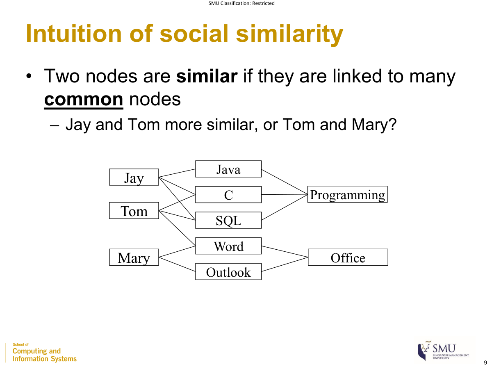
<figcaption aria-hidden="true">
Skills graph used for Jaccard and Adamic–Adar (Session 7, slide 9)
</figcaption>
</figure>

## Jaccard similarity

$$
\text{Jaccard}(a,b) = \frac{|N(a) \cap N(b)|}{|N(a) \cup N(b)|}
$$

where

- $N(a) \cap N(b)$: common neighbors of a and b (numerator = their count)
- $N(a) \cup N(b)$: all neighbors of a or b (the union normalizes the count); range 0–1

*Example:* Jay and Tom — common neighbors = 2, union = 4 → **0.5**; no common neighbor → 0.

## Adamic–Adar

$$
\text{AA}(a,b) = \sum_{v\, \in \, N(a) \cap N(b)}^{}\frac{1}{log|N(v)|}
$$

where

- $v$: a common neighbor of a and b
- $|N(v)|$: degree of v; a more popular common neighbor (larger $|N(v)|$) contributes **less** (“less useful”, behaves like a **stop node (FAQ)**)
- $\log$: natural log; the score normalizes common neighbors by the neighbors’ influence and is not bounded by 1

*Example:* common neighbors {SQL (deg 3), Word (deg 4)} → $\frac{1}{\ln 3} + \frac{1}{\ln 4} = 0.910 + 0.721 = \mathbf{1.63}$. Only {Word (deg 4)} → **0.721**. (Jaccard weights all common neighbors equally; Adamic–Adar discounts by degree.)

## SimRank (recursive)

$$
S(a,b) = \frac{C}{|N(a)|\,|N(b)|}\sum_{a' \in N(a)}^{}{\sum_{b' \in N(b)}^{}S}(a',b')
$$

where

- $S(a,b)$: similarity of a and b; **base case** $S(a,a) = 1$
- $C$: damping factor, typically 0.85
- $N(a),N(b)$: neighbor sets; $|N(a)|\,|N(b)|$ = number of neighbor pairs (averaging factor)
- $a',b'$: a neighbor of a and a neighbor of b (two nodes are similar if linked to **similar** nodes)

*Example (4-node diamond A–C–B, A–D–B, C–D; C=0.85; iteration 0 = 1 if a=b else 0):* $S_{1}(A,B) = 0.85 \cdot \frac{1 + 0 + 0 + 1}{4} = \mathbf{0.425}$; $S_{1}(A,C) = 0.85 \cdot \frac{1}{6} = \mathbf{0.142}$. (SimRank: one score **per pair**, must start from the base case; PageRank: per node, any start.)

## Graph edit distance

$$
\text{GED}(G_{1},G_{2}) = min\left( \text{number of edit operations to transform }G_{1} \rightarrow G_{2} \right)
$$

where

- edit operations: vertex/edge **insertion, deletion, or substitution**
- smaller GED = more similar graphs

*Example:* one edge deletion + one vertex substitution → **GED = 2**.

### Comparison

| Measure     | Based on                                 | Range             |
|-------------|------------------------------------------|-------------------|
| Jaccard     | common neighbors (∩ / ∪)                 | 0–1               |
| Adamic–Adar | common neighbors discounted by influence | 0 to ∞            |
| SimRank     | similar neighbors (recursive)            | 0–1               |
| GED         | minimum edit operations (whole graph)    | 0 to ∞ (distance) |

------------------------------------------------------------------------

# SESSION 8 — Word & Network Embedding

## Why embeddings

The vector space model has **Issue 1 — curse of dimensionality** (high-dimensional, sparse) and **Issue 2 — inadequate semantics** (related words look unrelated). A **word embedding** maps each word to a **low-dimensional** vector (e.g. 100 or 200 dims) where similar words are close; dimensions carry hidden meaning **(FAQ — latent)**. Core idea: **similar/related words appear in similar contexts.**

## Word2Vec — SkipGram

**SkipGram** predicts the **context** words from the **target** word; **context** = the words within a **window size** before and after the target. (CBOW, the reverse, is not in this deck.)

### Context–target pair count example ⭐

How many context-target pairs can be formed in a sentence of 20 words, assuming a window size of 5 words?

$$
\text{pairs} = 35 + 100 + 35 = 170\quad\quad\left( \text{shortcut: }N \cdot 2m - m(m + 1) \right)
$$

where

- $N$: sentence length (number of words) — here 20
- $m$: window size per side — here 5
- the slide counts directly: first 5 words give 5+6+7+8+9 = 35; middle 10 give $10 \times (5 + 5) = 100$; last 5 give 9+8+7+6+5 = 35
- the closed form $N \cdot 2m - m(m + 1) = 20 \cdot 10 - 30 = 170$ is a shortcut (not on the slide)

<figure>
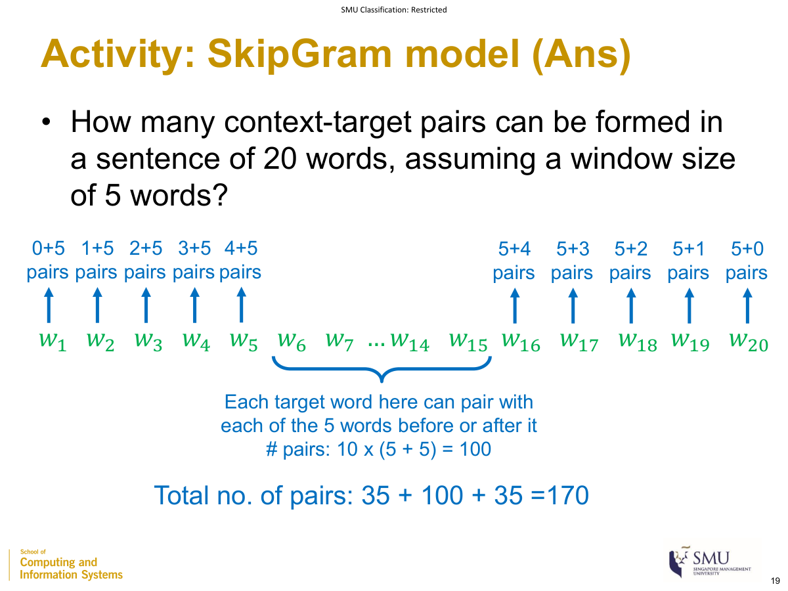
<figcaption aria-hidden="true">
Counting SkipGram context–target pairs → 170 (Session 8, slide 19)
</figcaption>
</figure>

## Cosine similarity in embedding space

$$
cos(a,b) = \frac{a \cdot b}{\left\| a \right\|\,\left\| b \right\|}
$$

where

- $a,b$: two embedding vectors (of words or nodes)
- $a \cdot b$: dot product; $\left\| a \right\|,\left\| b \right\|$: their lengths; range −1 to 1 (used to find closest words/nodes, e.g. “cos = 0.78”)

*Example:* $a = (1,2,2)$, $b = (2,0,1)$ → dot = 4, ‖a‖ = 3, ‖b‖ = √5 ≈ 2.236 → 4/6.708 = **0.596**.

## Document vector aggregation

Word2Vec gives one vector per word; to get one vector per document, **average** the word vectors:

$$
\text{doc vector} = \frac{1}{n}\sum_{i = 1}^{n}w_{i}
$$

where

- $w_{i}$: embedding vector of the i-th word in the document
- $n$: number of words (averaging keeps a fixed dimension and is length-normalized)

| Method | Plausible? | Reason |
|----|----|----|
| Concatenation | No | variable dimension |
| Sum | Yes | fixed dimension, but longer documents give larger values |
| **Average** | Yes (best) | fixed dimension and length-normalized |

*Example:* word vectors (1,0,2), (0,3,1), (2,1,0) → sum (3,4,3); average **(1, 1.33, 1)**.

## Network embedding — DeepWalk

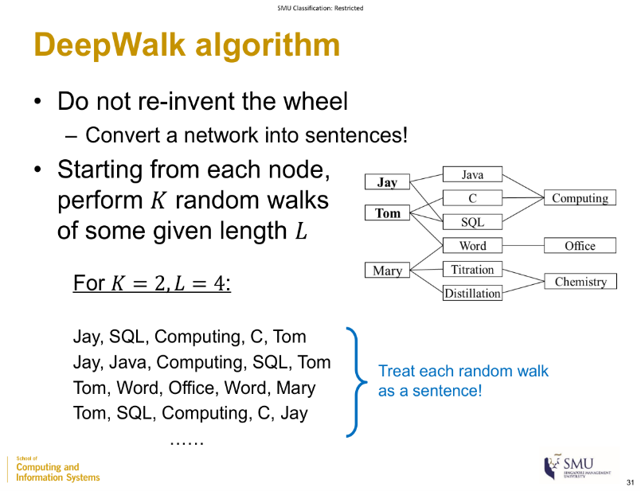

Reuse word embedding by analogy: **node ↔ word, random walk ↔ sentence, neighboring/reachable nodes ↔ context words.** 1. From each node, perform **K random walks of some given length L.** 2. Treat each random walk as a sentence. 3. Feed the walks into Word2Vec SkipGram. (Recommended $K \approx L \approx 50$ **(FAQ)**; weighted/directed graphs handled at the random-walk stage **(FAQ)**.)

**Using node vectors:** social influence → regression; community detection → clustering; node/social similarity → cosine similarity; node classification → SVM / logistic regression.

# MASTER FORMULA CHEAT-SHEET

| \# | Formula | Meaning | Session |
|----|----|----|----|
| 1 | $\|E\| = n(n - 1)/2$ | edges in a complete graph | 1 |
| 2 | $\sum deg(v) = 2\|E\|$ | degree and edges | 1 |
| 3 | $\text{cost} = 1/\text{weight}$ (FAQ) | weight as cost | 1 |
| 4 | nodes $= d + 1$, max edges $= d(d + 1)/2$ | ego-network size | 2 |
| 5 | $L \propto logN$ | small-world diameter | 2 |
| 6 | $C = 3 \times \text{triangles}/\text{all triplets}$ | clustering coefficient | 2 |
| 7 | $p_{u} = d_{u}/\sum_{v}^{}d_{v}$ | preferential attachment | 2 |
| 8 | $h = \text{same-class edges}/\text{total edges}$ | homophily ratio | 2 |
| 9 | $\text{tf-idf} = \text{tf} \times \text{idf}$ | term weighting | 4 |
| 10 | $\text{CosineSim} = \frac{a \cdot b}{\left\| a \right\|\left\| b \right\|}$ | document / embedding similarity | 4,7,8 |
| 11 | $P = \prod_{i}^{}p_{i} \times k!$ | topic model | 4 |
| 12 | $C_{\deg} = deg(u)/\|V\|$ | degree centrality | 5 |
| 13 | $C_{close} = (\|V\| - 1)/\sum_{v}^{}d(u,v)$ | closeness centrality | 5 |
| 14 | $\text{betweenness}(u) = \sum\sigma_{st}(u)/\sigma_{st}$ | betweenness centrality | 5 |
| 15 | $x_{u} = \frac{1 - \alpha}{\|V\|} + \alpha\sum\frac{x_{v}}{\text{outdeg}(v)}$ | PageRank ($\alpha = 0.85$) | 5 |
| 16 | $Q = \frac{1}{2m}\sum(A_{ij} - \frac{k_{i}k_{j}}{2m})\delta$ | modularity | 6 |
| 17 | $\text{betweenness}(e) = \sum\sigma_{st}(e)/\sigma_{st}$ | edge betweenness | 6 |
| 18 | $\text{Jaccard} = \frac{\|N(a) \cap N(b)\|}{\|N(a) \cup N(b)\|}$ | node similarity | 7 |
| 19 | $\text{AA} = \sum 1/ln\|N(v)\|$ | Adamic–Adar | 7 |
| 20 | $S(a,b) = \frac{C}{\|N(a)\|\|N(b)\|}\sum\sum S(a',b')$ | SimRank | 7 |
| 21 | pairs $= 35 + 100 + 35 = 170$ | SkipGram pair count | 8 |
| 22 | doc vector $= \frac{1}{n}\sum w_{i}$ | document embedding (average) | 8 |
